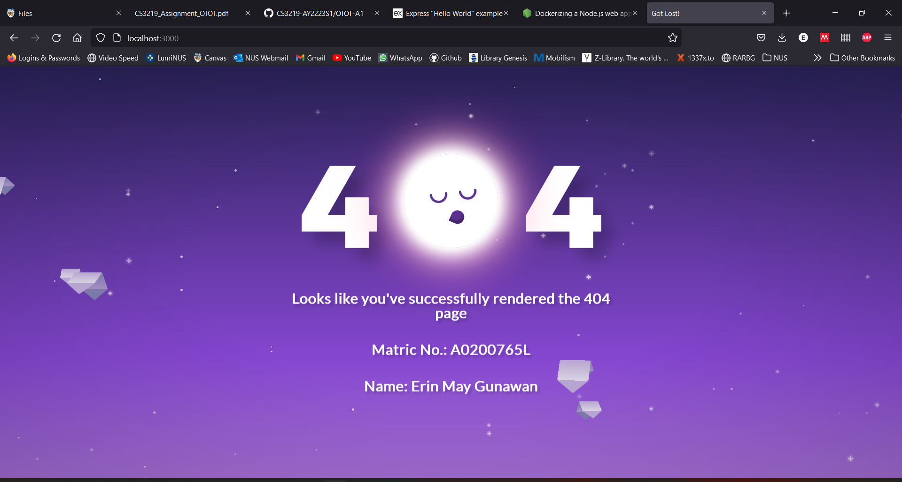
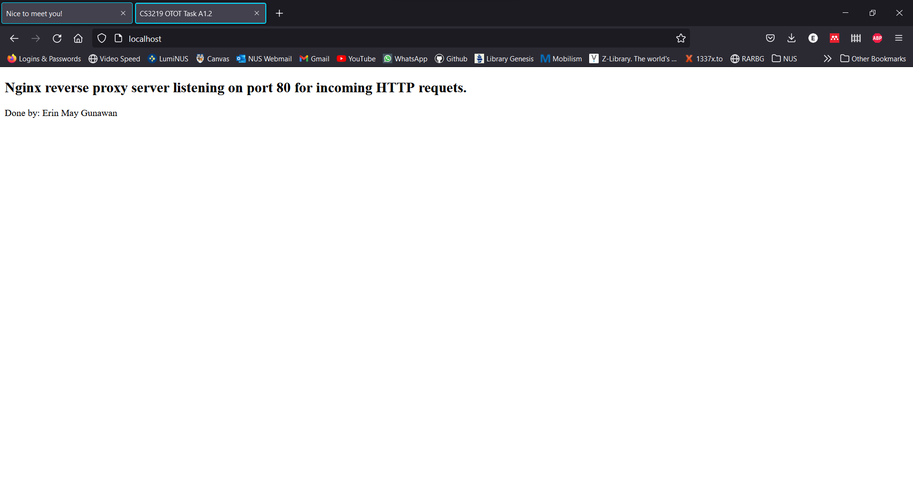
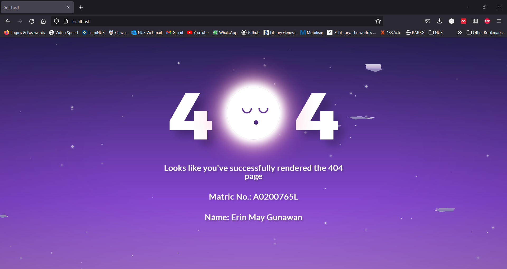

# CS3219 OTOT Task A1

Name: Erin May Gunawan

Matric. No: A0200765L

GitHub Repo Link: [A1](https://github.com/erinmayg/OTOT-A1)

Demo Link: [A1](https://drive.google.com/file/d/10ILxVVv09yIQnf5LMqVq53Tdw0BfQXfE/view?usp=sharing)

---

In general, the steps on how to dockerize and run a container is as follows:

1. Create a Dockerfile, each containing a number of stanzas
2. Build the container image by typing the command:

    ```bash
    docker build -t <image-name> <dockerfile path>
    ```

3. Run the container by typing the command:

    ```bash
    docker run -d --name <container-name> -p <machine-port:container-port> <image-name>
    ```

All flags may be omitted. Flags info:

- `-d` to run the container in the background
- `--name` the container-name, if unassigned a random one would be used
- `-p` the port to expose

## Task A1.1

How to run the Node.js container:

1. Create a Dockerfile within the app directory, by running the following command:

    ```bash
    touch Dockerfile
    ```

1. Fill in the Dockerfile with the following content:

    ```Dockerfile
    # Base image used (unspecified tag will use the latest one available in Dockerhub)
    FROM node:16

    # Create app directory
    WORKDIR /usr/src/app

    # Install app dependencies
    # A wildcard is used to ensure both package.json AND package-lock.json are copied
    # where available (npm@5+)
    COPY package*.json ./

    RUN npm install
    # If you are building your code for production
    # RUN npm ci --only=production

    # Bundle app source
    COPY . .

    EXPOSE 8080
    CMD [ "node", "index.js" ]
    ```

1. Run the following commands to build the image and get the container up and running:

    ```bash
    # Build the image
    docker build -t erinmayg/node-web-app .

    # Run the container
    docker run -d --name node-web-app -p 3000:8080 erinmayg/node-web-app
    ```

1. You can check whether the container is up and running by typing the command:

    ```bash
    # Lists all docker containers (exited and running)
    docker ps -a

    # Check logs
    docker logs node-web-app
    ```

1. Once the container is ready (running), you can view the static webpage in your browser by opening <http://localhost:3000>.

    

## Task A1.2

How to run the nginx container:

1. Create a `nginx.conf` configuration file within the `nginx-sample` directory.

    ```bash
    touch nginx.conf
    ```

2. Fill in the configuration file with the following:

    ```bash
    server {
        listen       80;
        listen  [::]:80;
        server_name  localhost;

        root   /usr/share/nginx/html;
        
        location / {
            index  index.html index.htm;
            
            # a bunch of boilerplate proxy configuration
            proxy_set_header Host $host;
            proxy_set_header X-Real-IP $remote_addr;
            proxy_set_header X-Forwarded-For $proxy_add_x_forwarded_for;
            proxy_set_header X-Forwarded-Proto $scheme;

            proxy_pass https://localhost:80/index.html;
        }
    }
    ```

    Note: template taken from the configuration file in `/etc/nginx/conf.d/default.conf` from the `nginx` image in Dockerhub.

3. Create a Dockerfile within the `nginx` directory.

    ```bash
    touch Dockerfile
    ```

4. Fill in the Dockerfile with the following:

    ```Dockerfile
    FROM nginx
    COPY index.html /usr/share/nginx/html/
    COPY nginx.conf /etc/nginx/conf.d/
    ```

5. Build and run the image

    ```bash
    # Build the image
    docker build -t erinmayg/nginx-sample .

    # Run the image
    docker run -d --name nginx-sample -p 80:80 erinmayg/nginx-sample
    ```

6. You can check whether the container is up and running by typing the command:

    ```bash
    # Lists all docker containers (exited and running)
    docker ps -a

    # Check logs
    docker logs nginx-sample
    ```

7. Once the container is ready (running), you can view the static webpage in your browser by opening <http://localhost:80>.

    

## Task A1-3

How to run nginx reverse proxy:

1. Create a `nginx.conf` configuration file within the `nginx` directory.

    ```bash
    touch nginx.conf
    ```

2. Fill in the configuration file with the following:

    ```bash
    server {
            # this server listens on port 80
            listen 80 default_server;
            listen [::]:80 default_server;
            
            server_name nodeserver;

            # the location / means that when we visit the root url (localhost:80/), we use this configuration
            location / {
                    # a bunch of boilerplate proxy configuration
                    proxy_set_header Host $host;
                    proxy_set_header X-Real-IP $remote_addr;
                    proxy_set_header X-Forwarded-For $proxy_add_x_forwarded_for;
                    proxy_set_header X-Forwarded-Proto $scheme;

                    # the real magic is here where we forward requests to the address that the Node.js server is running on
                    proxy_pass http://nodeserver:8080;
            }
    }
    ```

    Note:
    - `nodeserver` is the service name that will be defined in the `docker-compose.yaml` file later on. It can be replaced with other names as long as the `docker-compose.yaml` file follows suit.
    - `8080` is the port number exposed in `app/Dockerfile`

3. Create a Dockerfile within the `nginx` directory.

    ```bash
    touch Dockerfile
    ```

4. Fill in the following inside the Dockerfile:

    ```Dockerfile
    FROM nginx
    COPY nginx.conf /etc/nginx/conf.d/default.conf
    ```

5. Create the `docker-compose.yaml` file in the root folder for this project.

    ```bash
    touch docker-compose.yaml
    ```

6. Fill in the following inside the `docker-compose.yaml` file:

    ```yaml
    version: '3.8'
    services:
      nodeserver:
        container_name: node-web-app
        build:
        context: ./app
        ports:
          - '3000:8080'
      nginx:
        container_name: nginx-rev-proxy
        restart: always
        build:
        context: ./nginx
        ports:
          - '80:80'
    ```

    Note:
    - the service `nodeserver` is the same as the servername defined in `nginx/nginx.conf`

7. Build and run the containers by running in the root project directory:

    ```bash
    docker-compose up --build
    ```

8. You can check `http://localhost:80` in your web browser. It should now show the same page as in [Task A1.1](#task-a11), which is evident that the reverse proxy is at work.

    
